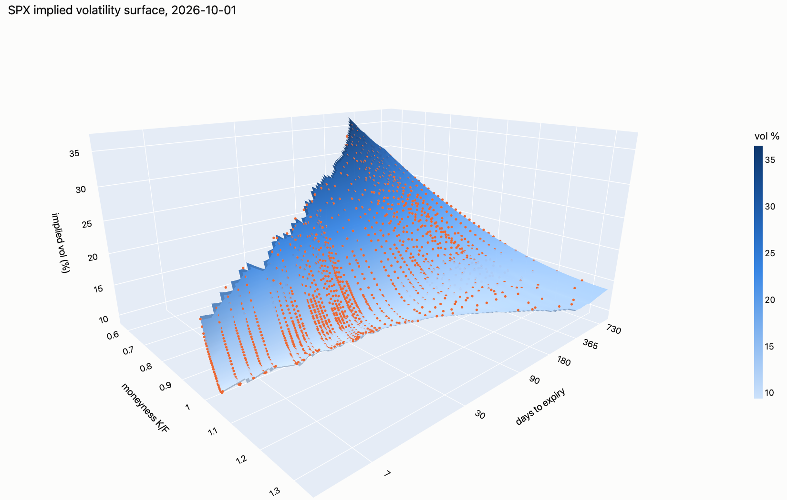
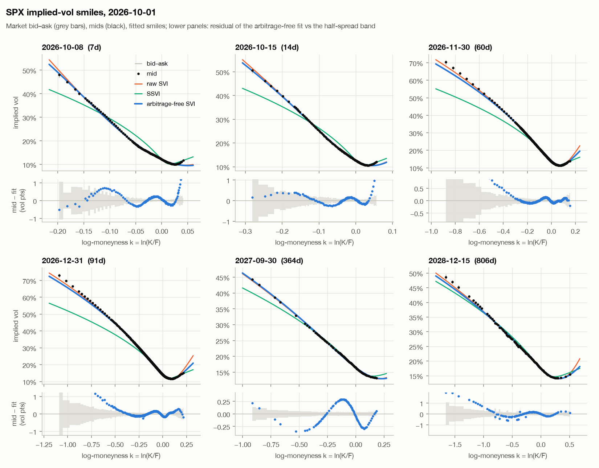
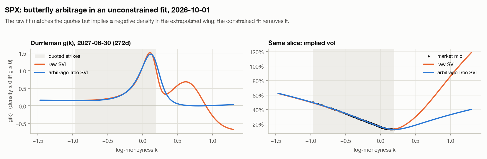
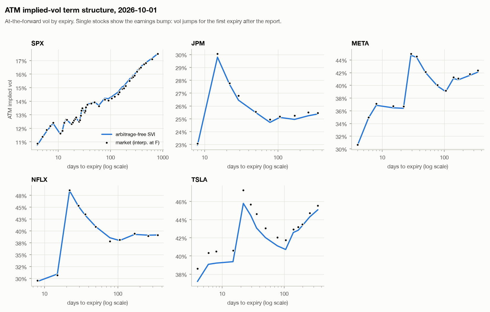
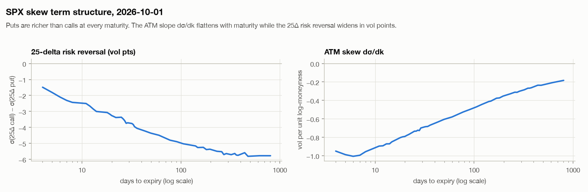
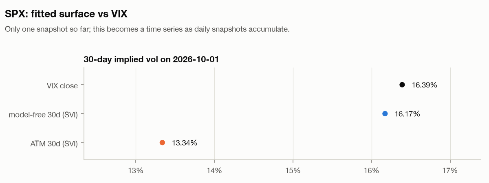
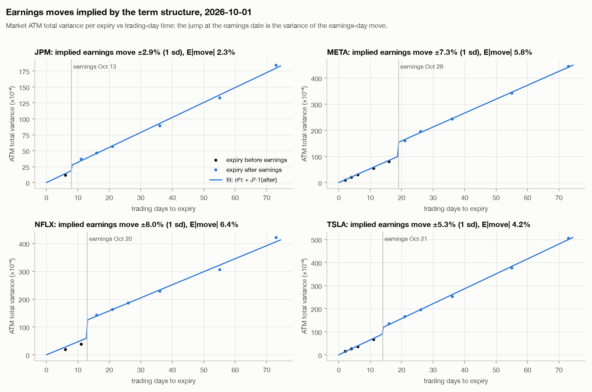

# vol-surface

**An implied-volatility surface engine built from scratch on real option quotes: on the 2026-10-01 close, an arbitrage-free SVI surface fits 8,810 SPX quotes across 48 expiries with a median error of 0.30 vol points, and the model-free 30-day vol computed from it (16.17%) is within 0.22 vol points of the VIX close (16.39).**

Live, interactive version (3D surface and smile explorer for every underlying): **https://hacks1234646.github.io/vol-surface/**

Data: Yahoo Finance option chains for **SPX index options** (European, cash-settled) and four single stocks reporting earnings in October 2026 (JPM, NFLX, TSLA, META), plus US Treasury par yields. Everything downstream of the raw quotes is implemented here: put-call-parity forwards, Black-Scholes and Greeks, a vectorized implied-vol solver, SVI / SSVI calibration with no-arbitrage constraints, the arbitrage diagnostics and the analytics.

> **History is still short.** The project currently holds **one** daily snapshot (2026-10-01). A GitHub Actions job collects one snapshot after every trading-day close and redeploys the site. The time-series analysis (term structure and skew over time, 30-day vol vs VIX) is written to update as snapshots accumulate. Results that need history are shown as single-day values until then.





## Run it (three commands)

```bash
git clone https://github.com/hacks1234646/vol-surface && cd vol-surface
make install   # venv + dependencies + package (Python >= 3.11)
make build     # clean, fit and analyse every snapshot in data/; writes figures and the site to docs/
```

`make collect` fetches today's snapshot (after the close), `make test` runs the 47 unit tests, and `make lint` runs ruff. The CLI is `volsurface {collect,process,build}`.

## Results (2026-10-01 close)

### Fit quality

Median across expiries of the RMSE between fitted and mid implied vol, in vol points:

| Underlying | Expiries | Quotes | Raw SVI | Arb-free SVI | SSVI | ATM 30d | RR25 30d (vol pts) |
|---|---:|---:|---:|---:|---:|---:|---:|
| SPX | 48 | 8,810 | 0.20 | 0.30 | 2.28 | 13.34% | -3.73 |
| JPM | 10 | 246 | 0.21 | 0.23 | 0.35 | 26.38% | -2.34 |
| META | 14 | 1,228 | 0.15 | 0.16 | 0.73 | 44.68% | 0.24 |
| NFLX | 11 | 385 | 0.53 | 0.54 | 1.67 | 44.90% | 0.20 |
| TSLA | 15 | 1,328 | 0.77 | 0.78 | 5.24 | 44.23% | 0.29 |

- **Removing arbitrage costs about 0.1 vol points on SPX.** The arbitrage-free SVI gives up about 0.1 vol points of in-sample fit against the unconstrained per-expiry SVI (0.20 → 0.30), in exchange for a surface with no butterfly or calendar arbitrage anywhere on the test grid. On single stocks the cost is ≤ 0.02 vol points.
- **SSVI fits poorly but cannot arbitrage.** SSVI, with three parameters for the whole surface, is arbitrage-free by construction but misses by 2.3 vol points on SPX. A single correlation parameter cannot describe both the steep short-dated skew and the flatter long-dated skew. It is kept as the parsimonious benchmark.
- **Bid-ask spreads are tighter than the fit.** SPX quotes are tight: median half-spread about 0.05–0.1 vol points near the money. The arbitrage-free fit lands inside the bid-ask on 31% of SPX quotes (median across expiries), so the residual plots show the remaining structure honestly.

### Static arbitrage: market vs fit

Counts of violating test points: consecutive strike pairs/triples for quotes, grid points on a common log-moneyness grid for fits. "Market quotes" are all out-of-the-money quotes passing the quote-level filters, *before* consistency-based stale-quote removal.

| Underlying | Object | Butterfly violations / tests | Calendar violations / tests |
|---|---|---:|---:|
| SPX | market quotes (mid) | 2,448 / 17,654 | 62 / 8,542 |
| SPX | market quotes (executable bid/ask) | 388 / 17,654 | 57 / 8,542 |
| SPX | raw SVI (per slice) | 2,180 / 14,448 | 3,843 / 14,147 |
| SPX | **arbitrage-free SVI** | **0** / 14,448 | **0** / 14,147 |
| SPX | SSVI (global) | 0 / 14,448 | 0 / 14,147 |
| TSLA | market quotes (executable bid/ask) | 4 / 2,547 | 0 / 1,068 |
| TSLA | raw SVI (per slice) | 348 / 4,515 | 1,100 / 4,214 |
| TSLA | **arbitrage-free SVI** | **0** / 4,515 | **0** / 4,214 |

(The full table for all five underlyings is on the [site](https://hacks1234646.github.io/vol-surface/) and in [`docs/results.json`](docs/results.json).)

- **Mid prices violate convexity often, but almost none of it is tradeable.** On SPX, 14% of the strike-pair and strike-triple tests fail at mids, mostly adjacent 5-point strikes whose mids differ by about one tick. That is quote noise, not arbitrage.
- **The executable SPX violations come from stale quotes.** Almost all of them sit in Yahoo's SPXW quarterly and end-of-month series, which interleave live quotes with frozen lines that last traded weeks earlier. Removing the stalest quote in each executable arbitrage (134 SPX quotes) leaves **zero executable arbitrage in every underlying**. That removal is part of the cleaning step.
- **Raw SVI violates arbitrage mostly outside the data.** Unconstrained SVI fits are close to the quotes where quotes exist. Their arbitrage is almost entirely in the extrapolated wings and in crossings between neighbouring expiries:



### Term structure, skew and VIX



- **SPX term structure:** upward-sloping, from 12.1% ATM at 7 days to 16.5% at one year.
- **SPX skew:**
  - The 30-day 25-delta risk reversal is −3.7 vol points and the 91-day is −4.9.
  - The ATM slope dσ/dk is about −0.69 at 30 days and flattens with maturity (below).
  - Single stocks have much flatter, slightly call-skewed smiles; the exception is JPM (−2.3).
- **30-day vol vs VIX:**
  - **Model-free 30-day vol (16.17%) vs VIX close (16.39):** computed from the fitted SVI smiles with the continuous-strike version of the VIX formula and interpolated to 30 days as the CBOE does. The 0.22 vol-point gap checks the whole chain (forwards, discounting, IVs, wing extrapolation) against an independent published number.
  - **ATM 30-day vol (13.34%) sits 3 points lower** because the log-contract also prices the skewed wings.





### Earnings moves implied by the term structure

| Stock | Earnings | Implied move (1 sd) | E\|move\| | Two-expiry estimate | ATM straddle / F | Base vol |
|---|---|---:|---:|---:|---:|---:|
| JPM | 2026-10-13 | 2.89% | 2.31% | 3.97% | 4.86% | 24.3% |
| META | 2026-10-28 | 7.29% | 5.82% | 7.37% | 10.11% | 36.6% |
| NFLX | 2026-10-20 | 8.02% | 6.40% | 9.28% | 9.52% | 34.3% |
| TSLA | 2026-10-21 | 5.30% | 4.23% | 6.01% | 9.25% | 40.3% |



- **The straddle heuristic overstates the event move.** The straddle price of the first post-earnings expiry includes all the ordinary diffusion up to that expiry. The decomposition separates the two.
- **The two-expiry estimate is noisier.** It uses only the last pre-earnings and first post-earnings expiries, so it inherits all of their noise. The regression uses every expiry within 120 days.
- **JPM is the least reliable.** Only one pre-earnings expiry passes the filters.

## Methodology

### 1. Data and time

- **SPX vs SPY:** Yahoo serves SPX index options (`^SPX`, roots SPX and SPXW), so the index work uses European options and avoids SPY's American-exercise bias. SPY is not needed.
- **Snapshots** are stored as raw quotes (parquet, about 0.8 MB/day) under `data/snapshots/<date>/`, together with the Treasury curve and the VIX close. All cleaning is downstream, so it can be changed and the full history re-processed.
- **Time to expiry** is ACT/365 in calendar time, from the 16:00 ET close to settlement. Settlement is 09:30 ET for AM-settled SPX monthlies and 16:00 ET otherwise. When an expiry has both SPX (AM) and SPXW (PM) series, the one with more two-sided quotes is kept.
- **Rates:** Treasury par yields (FRED as fallback), converted from bond-equivalent to continuous compounding, r = 2 ln(1 + y/2), and interpolated linearly. They are only a prior: discount factors come from parity wherever they can (next section).

### 2. Cleaning

Every quote keeps a `drop_reason`, so the cleaning is auditable (SPX counts on 2026-10-01 in brackets):

| Filter | Rule | SPX |
|---|---|---:|
| zero bid | bid ≤ 0 | 749 |
| crossed / locked | ask ≤ bid | 13 |
| wide market | (ask − bid) / mid > 50% | 492 |
| stale line | no trade in 90 days (Yahoo has no quote timestamps; catches e.g. NFLX pre-split strikes still showing 2025 markets) | 441 |
| in the money | only OTM options relative to the parity forward are used (puts below F, calls above) | 5,349 |
| parity outlier | strike pair inconsistent with the parity regression | 36 |
| IV outlier | more than max(3 × IV half-spread, 2 vol pts) from the rolling median of neighbouring strikes | 28 |
| executable arbitrage | quote forms a tradeable butterfly / vertical-spread arbitrage with its neighbours; the stalest quote is removed until none remain | 134 |
| **used** | | **8,810** |

### 3. Forward and discount factor from put-call parity

For each expiry, C − P = D·F − D·K. A weighted least-squares fit of (C − P) on K over near-the-money strikes gives the discount factor D (minus the slope) and the forward F (intercept / D), with weights equal to the inverse squared bid-ask widths:

1. **Robust pre-screen.** Per-strike forwards K + (C − P)/D are compared with their median, using a MAD-scaled tolerance. A handful of stale lines otherwise drags the regression.
2. **When D is estimated.** For European options with at least 30 days to expiry, D is taken from the regression if the implied rate is within 200 bp of the curve. Otherwise D comes from the Treasury curve and only F is estimated.
3. **American options (single stocks).** Parity is only an inequality for American options, so D always comes from the curve. F comes from the strikes nearest the money, where the early-exercise premium is smallest.

Findings:

- **SPX financing above Treasuries.** The SPX parity-implied rate runs about 58 bp above Treasury CMT yields beyond 60 days, consistent with the known premium of SPX box-spread financing over Treasuries.
- **Discrete dividends.** JPM's short-dated forwards show its October ex-dividend date (negative implied carry), with no dividend model needed.
- **Parity fit quality.** Median parity residual for SPX: 0.22 index points.

### 4. Black-Scholes and implied volatility

Forward (Black-76) form, with log-moneyness k = ln(K/F) and total variance w = σ²T:

$$C = D\,[F\,N(d_1) - K\,N(d_2)],\qquad d_{1,2} = \frac{-k}{\sqrt{w}} \pm \frac{\sqrt{w}}{2}$$

The spot form with continuous dividend yield and all Greeks (delta, gamma, vega, theta, rho, vanna, volga) are implemented in `black_scholes.py`.

**Implied vol solver** (`iv.py`), vectorized over a whole chain:

1. Convert in-the-money prices to the equivalent OTM price by parity, which removes the intrinsic value that would swamp the time value.
2. Check the no-arbitrage bounds 0 < p < min(1, e^k) in units of the forward; anything outside returns NaN.
3. Run Newton on **log price** in total vol s = σ√T. In the wings the price is tiny and convex, and log space keeps Newton fast there.
4. Keep a bracket around the root (the price is increasing in s) and fall back to bisection whenever a Newton step would leave it, so convergence is guaranteed.

It inverts 200,000 random options in under a second, to within the floating-point conditioning bound.

### 5. Smile and surface fitting

**Raw SVI** per expiry:

$$w(k) = a + b\left[\rho\,(k-m) + \sqrt{(k-m)^2+\sigma^2}\right]$$

The parameter constraints are:

- b ≥ 0, |ρ| < 1, σ > 0;
- non-negative minimum variance, a + bσ√(1−ρ²) ≥ 0;
- **Roger Lee's moment bound** on the wing slopes, b(1 ± ρ) ≤ 2.

**Stage 1: quasi-explicit calibration** (Zeliade 2009). For fixed (m, σ), SVI is *linear* in (a, u, v), where u = bσ(1+ρ) and v = bσ(1−ρ). Lee's bound becomes the box 0 ≤ u, v ≤ 2σ, so the inner problem is a bounded linear least-squares solve and only (m, σ) is searched (grid, then Nelder-Mead).

Residuals are weighted by each quote's bid-ask uncertainty expressed in total variance (dw = 2σT·dσ), so the objective is approximately Σ((σ_model − σ_mid)/half-spread)².

**Stage 2: arbitrage-free SVI.**

- **Butterfly:** Durrleman's condition must hold on a dense grid,

$$g(k) = \Big(1 - \frac{k\,w'}{2w}\Big)^2 - \frac{w'^2}{4}\Big(\frac{1}{w}+\frac{1}{4}\Big) + \frac{w''}{2} \;\ge\; 0,$$

  where g(k) is, up to a positive factor, the risk-neutral density.
- **Calendar:** the slice must stay between its fitted neighbours, w_{T₁}(k) ≤ w_T(k) ≤ w_{T₂}(k), with ordered wing slopes so slices cannot cross in the extrapolated wings.
- **How each constraint is imposed:** the calendar constraints are linear in (a, u, v) and enter the inner problem as a small convex QP (Goldfarb-Idnani via `quadprog`). Durrleman's condition enters the outer search as an exact L1 penalty, followed by a final SLSQP polish if needed.
- **Fitting order:** slices are fitted in order of strike coverage, widest first. Data-rich expiries pin down the wings, and narrowly quoted expiries are sandwiched between fitted neighbours instead of letting their extrapolated wings constrain the rest.

The full 48-expiry SPX surface fits in about 4 seconds. Between expiries, total variance is interpolated linearly in T at fixed k, which preserves the calendar ordering.

**SSVI** (Gatheral & Jacquier 2014) as a global benchmark:

$$w(k,\theta_t) = \frac{\theta_t}{2}\Big(1 + \rho\varphi k + \sqrt{(\varphi k + \rho)^2 + 1 - \rho^2}\Big),\qquad \varphi(\theta) = \frac{\eta}{\theta^\gamma(1+\theta)^{1-\gamma}}$$

- θ_t is the market ATM total variance, made monotone by isotonic regression.
- The constraints 0 < γ ≤ ½ and η(1 + |ρ|) ≤ 2 are sufficient for no static arbitrage.

### 6. Arbitrage checks (`arbitrage.py`)

- **Quotes, one expiry.** OTM quotes are converted to call prices by parity and checked on consecutive strikes. Calls must be decreasing in strike, with slope ≥ −1 per unit forward, and convex: the butterfly λC(K₁) + (1−λ)C(K₃) − C(K₂) must be ≥ 0. Each check is run at mids and at executable prices (wings bought at the ask, body sold at the bid).
- **Quotes, across expiries.** At the longer expiry's strikes inside the shorter expiry's quoted range, w(k, T₂) ≥ w(k, T₁) must hold. It is checked at mids, and executably by comparing the longer expiry's ask with the shorter expiry's bid.
- **Fits.** Durrleman's g ≥ 0 and total variance ordered in T, both on a common grid spanning every expiry's strikes plus wings. Violations below 10⁻⁶ in total variance are treated as numerical noise; that is about 0.0003 vol points at one year.

### 7. Analytics (`analysis.py`)

- **ATM vol** at standard tenors comes from the arbitrage-free surface (at-the-forward, k = 0). **Skew** is measured three ways: the 25-delta risk reversal and butterfly (forward deltas found by root-finding on the fitted smile), σ(0.9F) − σ(1.1F), and dσ/dk at the money.
- **Model-free variance** of one smile, the continuous-strike VIX formula, with q(k) the undiscounted OTM price per unit forward:

$$\sigma^2_{\text{MF}}\,T = 2\int q(k)\,e^{-k}\,dk$$

  It is interpolated linearly in total variance between the two expiries bracketing 30 days.
- **Earnings move.** The market ATM total variance of each expiry is decomposed as

$$w(T) = \sigma_b^2\,\tau(T) + J^2\,\mathbf{1}\{T > t_E\}$$

  where τ is trading-day time on the NYSE calendar, so the base variance is not smeared over weekends. The model is fitted by non-negative least squares over expiries within 120 days. J is the standard deviation of the earnings-day log return, and E|move| = J√(2/π).

## Tests

47 unit tests (`pytest`) cover every piece of pricing and fitting math:

- **Black-Scholes:** Black-Scholes and Black-76 prices against Hull and Haug textbook values; Greeks against Hull and against finite differences; put-call parity on random inputs.
- **Implied vol:** round-trips across strikes, maturities and vol levels, plus 200,000 random options checked against the conditioning bound, and NaN for arbitrage-violating prices.
- **SVI:** derivatives; Durrleman's g equal to the density from finite-differenced call prices; Vogt's arbitrageable SVI example detected and repaired; calendar constraints respected; surface interpolation monotone in T.
- **SSVI:** random parameters satisfying the constraints produce no arbitrage; parameter recovery.
- **Cleaning:** synthetic chains with known forward and discount factor; each filter triggered.
- **Arbitrage:** each violation type detected; stale-quote repair.
- **Analytics:** model-free variance equals σ²T for a flat smile; closed-form delta strikes; jump recovery.
- **End to end:** quotes generated from a known arbitrage-free SSVI surface go through the whole pipeline, and the known ATM vols and ρ are recovered.

## Limitations

- **Data quality.** Yahoo quotes are free, delayed and asynchronous, with no quote timestamps. Stale lines are detected only from cross-sectional inconsistency (last-trade age, parity, neighbours, executable arbitrage), and some staleness inside the spread will remain. A professional feed (Cboe DataShop, OptionMetrics) would remove most of the cleaning.
- **One snapshot so far.** Statements about how term structure, skew or the VIX gap *behave over time* need the history the daily job is now collecting.
- **American exercise for single stocks.** Single-stock IVs are Black-76 IVs of American options using a parity forward. Using only OTM options keeps the early-exercise premium small but not zero, especially for puts on high-rate days and calls before ex-dividend dates. A proper treatment would de-Americanize prices with a binomial tree.
- **SVI's shape is restrictive.** Raw SVI cannot bend sharply enough at the money for TSLA. Both the raw and arbitrage-free fits sit about 1 vol point below the market ATM, which is why the earnings decomposition uses market ATM variance rather than the fit.
- **Extrapolation.** Calendar arbitrage is defined at fixed log-moneyness, which assumes proportional dividends. Wing extrapolation beyond the quoted strikes is model-dependent, and it matters for the model-free variance integral.
- **Collector dependence on Yahoo.** The daily job depends on Yahoo answering requests from GitHub's runners. If a day is missed (throttling, outage), it is simply absent; snapshots cannot be backfilled, because Yahoo serves no historical option chains. `make collect` after the close does the same thing locally.
- **Rate and event inputs.** Treasury par yields are used as zero rates, which costs a few basis points at option maturities. Earnings dates come from Yahoo and may be estimates; release timing (before or after the open) is not modelled.

## Next steps

- eSSVI with a maturity-dependent ρ, or a joint calibration of all slices, to close the gap between parsimony and fit.
- De-Americanize single-stock prices before inverting.
- With history: the variance risk premium (implied vs subsequently realized variance), the dynamics of skew against spot (sticky-strike vs sticky-delta), and an ex-post check of implied vs realized earnings moves.
- A local-volatility surface (Dupire) from the arbitrage-free fit, which the no-arbitrage constraints make well defined.

## Project layout

```
src/volsurface/
  collect.py        yfinance snapshots, Treasury/FRED rates, VIX
  rates.py          rate curve
  black_scholes.py  Black-Scholes / Black-76 prices and Greeks
  iv.py             vectorized implied-vol solver
  cleaning.py       quote filters, parity forward and discount factor, OTM IVs
  svi.py            raw SVI, Durrleman's condition, quasi-explicit and arbitrage-free calibration
  ssvi.py           SSVI surface
  surface.py        assembling slices into a surface, interpolation
  arbitrage.py      butterfly / calendar diagnostics for quotes and fits
  analysis.py       term structure, skew, model-free vol, earnings moves
  pipeline.py       per-snapshot processing and caching (data/derived/)
  plots.py, report.py  figures and the GitHub Pages site (docs/)
tests/              unit and end-to-end tests
.github/workflows/  CI, daily collection, Pages deployment
```

## References

- J. Gatheral, *The Volatility Surface* (2006); J. Gatheral & A. Jacquier, "Arbitrage-free SVI volatility surfaces", *Quantitative Finance* (2014).
- Zeliade Systems, "Quasi-explicit calibration of Gatheral's SVI model" (2009).
- R. Lee, "The moment formula for implied volatility at extreme strikes", *Mathematical Finance* (2004).
- Cboe, *VIX White Paper*.
